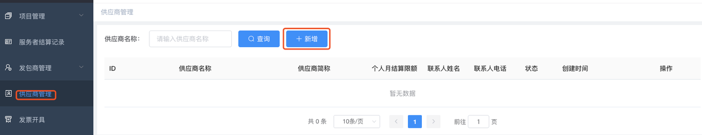
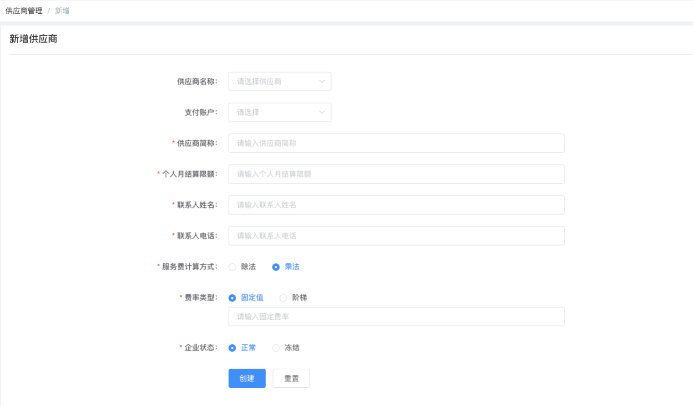

# 快速开始

| 术语名词 | 解释说明                                                                                             |
| :------- | :--------------------------------------------------------------------------------------------------- |
| 发包商   | 使用灵活用工人员并需要向灵活用工人员结算薪酬的企业方。                                               |
| 平台方   | 平台方向发包商提供灵活用工人员以及灵活用工人员的薪酬结算服务。                                       |
| 服务者   | 实际提供服务的灵活用工人员。                                                                         |
| 服务费率 | 服务费也叫项目管理费，即平台方提供服务收取的费用，按照结算金额的一定比例收取，这个比例就是服务费率。 |

## 1 新建项目

项目是本系统的业务基础，登录系统后，如果没有项目，则需要先创建项目，如下图所示：

图 1-1

创建项目界面的字段说明如下：

- **项目名称**：必填项，填写项目名称。
- **项目描述**：必填项，填写项目描述。
- **项目附件**：选填项，可上传项目相关的说明文档和资料等。
- **验收方式**：

  “线下验收”指在线下通过其它方式进行验收，即不在本系统内提交项目成果和验收确认，发包商在项目接单后可直接提交验收结算申请。

  “线上验收”指在本系统内体现验收流程，即需要由接单方登录对应端的系统，然后针对具体的项目向发包商发起“申请验收”，同时提交相关的项目产出；发包商收到申请后，查看项目产出，确认没问题后才能提交验收结算申请。

  一般建议选择“线下验收”。

- **合同扫描件**：选填项，如果项目双方已经签订合同，则建议上传合同扫描件。
- **在线签订合同**：目前系统尚未接入具有法律效应的电子合同，该项仅用于记录合同内容；目前建议选择“否”。

必填字段输入后，点击“立即创建”按钮即可。

## 2 验收结算

项目创建后，进入项目列表页面，如下图所示： 
图 2-1

请查看项目状态，如果状态为“进行中”，则可进行“验收”操作；

如果项目状态为“询价中”，则需要等待，如果平台方对该发包商设置了项目自动接单，则仅需稍待几秒后刷新界面，即可看到项目状态会变为“进行中”。

如图 2-1 所示，点击某“进行中”项目的“验收”按钮，进入项目验收界面，如下图所示：
 
图 2-2

项目验收界面的核心是“服务者信息”，可以点击“添加”按钮单个录入，也可以点击图 2-2 红框标记的“excel 导入”按钮批量录入，excel 模板请点击“模板下载”按钮获取。

数据导入后，系统会根据事先约定的服务费率计算服务费，确认各项费用正确无误后，点击图 2-2 界面最下方的“验收结算”按钮提交本次验收。

到此，所有的操作步骤已经完成了。 

## 3 结算状态跟踪

> 需要说明的是：服务者的费用结算不是实时到账的，而且如果提交的服务者数据(姓名、手机号、银行卡号、身份证号)有误，则可能会出现结算失败的情况。所以完成操作后，需要继续关注服务者的结算状态。

点击导航菜单“服务者结算记录”，即可跟踪每个服务者的结算状态，如下图所示：

 
图 3-1

结算状态说明：

- 已完成：表示已经结算成功，服务者的费用已经到账。
- 结算失败：表示已经结算失败，这种情况请联系服务人员。

其它状态请耐心等待，如果提交验收结算后超过 24 小时结算状态仍然不是“已完成”或“结算失败”，请联系服务人员。
