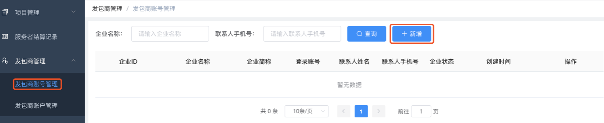
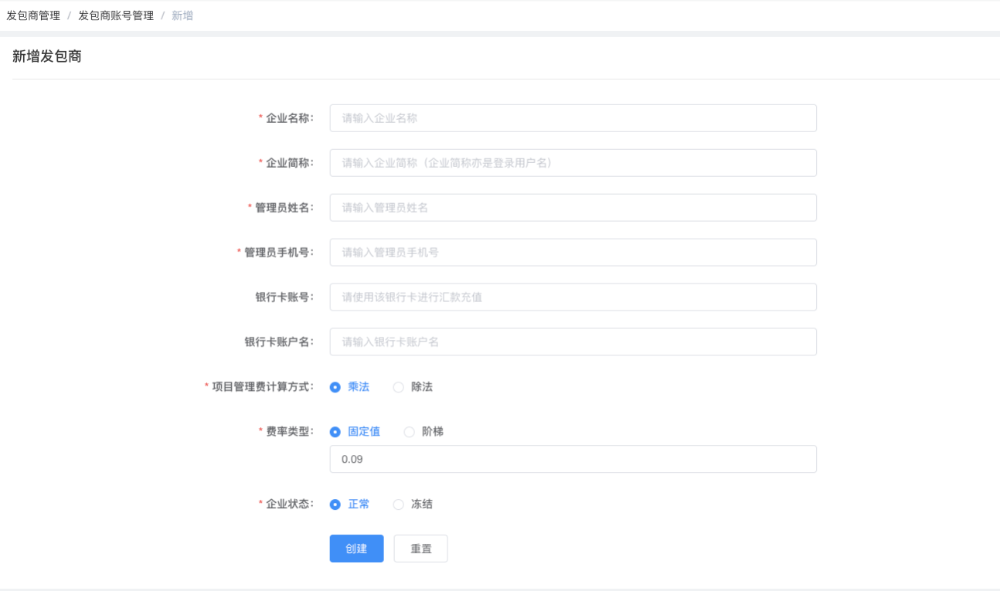
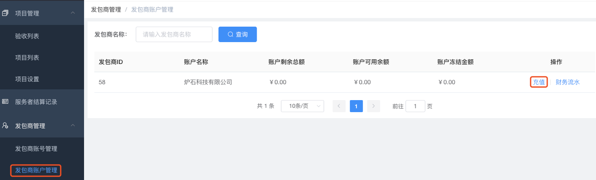
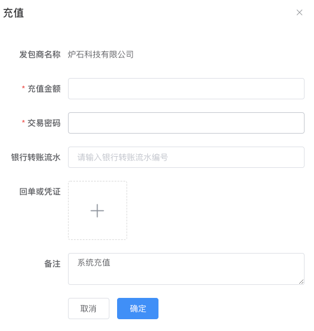
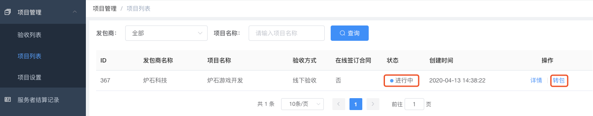
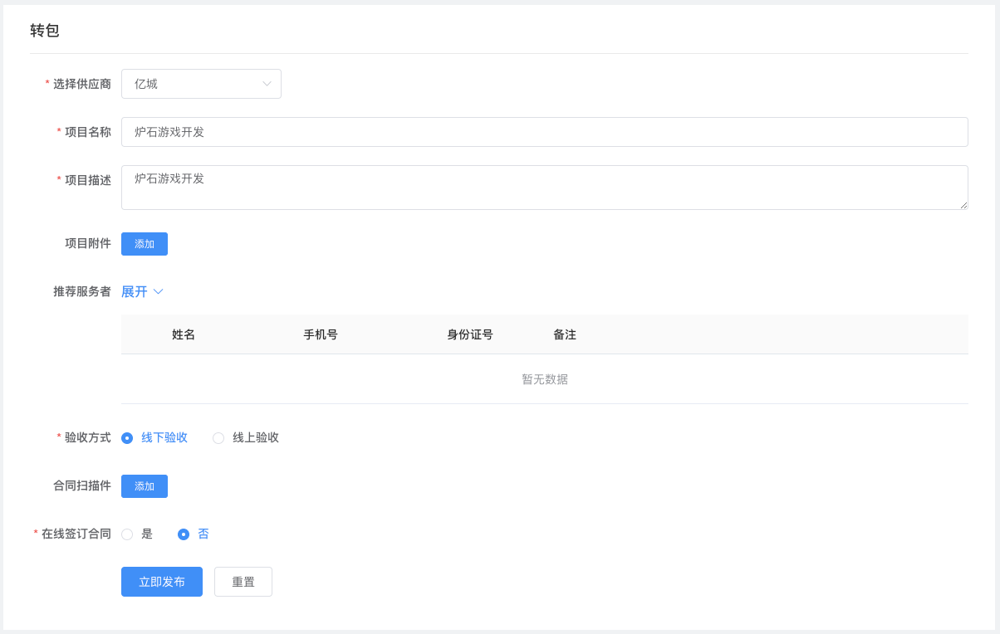
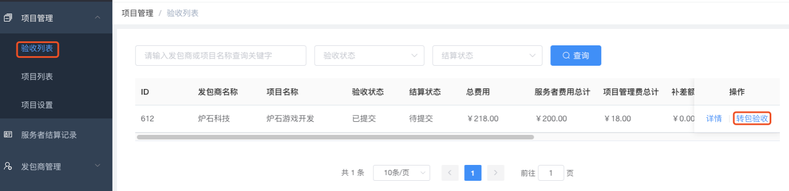
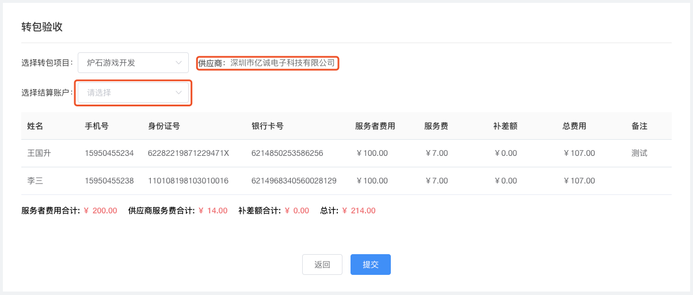
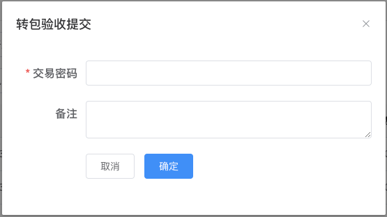

# 快速开始

| 术语名词     | 解释说明                                                                                                               |
| ------------ | ---------------------------------------------------------------------------------------------------------------------- |
| 发包商       | 使用灵活用工人员并需要向灵活用工人员结算薪酬的企业方。                                                                 |
| 平台方       | 平台方向发包商提供灵活用工人员以及灵活用工人员的薪酬结算服务。                                                         |
| 服务者       | 实际提供服务并获取薪酬的灵活用工人员。                                                                                 |
| 供应商       | 税地和结算供应商，实际向服务者结算薪酬的一方。                                                                         |
| 项目管理费   | 项目管理费，是平台方向发包商收取的费用，按照结算金额的一定比例收取，这个比例是发包商服务费率。注意和供应商服务费区分。 |
| 供应商服务费 | 供应商服务费，是供应商向平台收取的费用，按照结算金额的一定比例收取，这个比例是供应商服务费率。注意和项目管理费区分。   |
| 下发金额     | 也叫服务者费用，即服务者实际收到的金额。                                                                               |

查看本文档前，建议先查看[系统流程说明](quickStart/系统流程说明.md)。

## 1 发包商管理

### 1.1 发包商账号管理

平台端是为发包商服务的，所以登录平台端后，需要为自己的发包商客户创建账号。
进入“发包商账号管理”菜单，点击“新增”按钮，如下图所示：

点击“新增”按钮后，进入如下图所示界面：

- **企业名称：**必填，请输入企业完整名称，例如领客信息科技（南京）有限公司；
- **企业简称**：必填，例如“领客科技”，企业简称也是发包商登录发包商系统的登录用户名；
- **管理员姓名：**必填，管理员姓名；
- **管理员手机号：**必填，管理员手机号，部分操作的短信验证码将发送至该手机；
- **银行卡账号：**选填，发包商向平台汇款的公户银行卡卡号；
- **银行卡账户名：**选填(强烈建议填写)，发包商向平台汇款的公户银行卡账户名(一般为公司全称)；填写该项后，发包商用户向平台方指定的的实体银行卡账户汇款后，系统将自动向发包商账户充值。
- **项目管理费计算方式：**

      	乘法：服务费=下发金额\*服务费率
      	除法：服务费=总金额\*服务费率=(下发金额/(1-服务费率))\*服务费率

- **费率类型：**

      	固定值：即无论下发金额为多少，服务费率固定不变；
      	阶梯：即下发金额的范围(当月下发的总额)不同，服务费率也不同，一般发的越多，服务费率越高。

      	注意：这里的费率是平台方向发包商收取项目管理费的费率。

- **企业状态：**

      	正常：发包商可以登录发包商系统
      	冻结：发包商无法登录发包商系统

填写完成后，点击“创建”按钮即可。

发包商账号创建后，发包商可以登录发包商端进行相关操作，点击查看[发包商端系统帮助文档](http://doc.linker-union.com/quickStart/%E5%BF%AB%E9%80%9F%E5%BC%80%E5%A7%8B.html)。

### 1.2 发包商账户管理

点击导航栏“发包商账户管理”菜单，进入如下图所示界面：

图 1.2-1

在步骤 1.1 创建发包商账号后，系统会为发包商自动创建账户。
账户主要用于记录发包商的资金数据，发包商在提交验收结算的时候，账户里必须有足够的可用金额。

发包商的账户充值主要有两种方式：

**1 手动充值**
发包商将资金汇款至平台方指定的账户；但发包商未在步骤 1.1 填写“**银行卡账户名**”或者平台方指定的账户不是薪八达绑定的平安实体户。此时系统无法自动为发包商充值，需要操作人员在拿到银行汇款回单后，在图 1.2-1 界面找到对应的发包商账户，然后点击“充值”按钮进行充值。
充值界面如下图所示：

- **充值金额：必填，**单位元；
- **交易密码：必填，**交易密码默认和登录密码相同，可以在“账号信息”菜单修改交易密码；
- **银行转账流水：必填，**请填写付款回单上的流水号；
- **回单或凭证：选填，**上传付款回单；
- **备注：**选填**。**

**2 自动充值**
如果在步骤 1.1 创建发包商的时候，正确填写了“银行卡账户名”字段，且发包商用该银行卡汇款至平台端在薪八达绑定的实体账户中，则系统会在实体账户收到款项后，自动向发包商账户充值。

注意：由于系统有自动充值的能力，所以在手动充值前，一定要确认发包商的账户余额和流水，确保不要重复充值。

## 2 供应商管理

进入“供应商管理”菜单，点击“新增”按钮，如下图所示：

点击“新增”按钮后，进入如下图所示界面：

- **供应商名称：**必填，如果下拉选择框没有数据，请联系系统提供方；
- **支付账户：**必填，一般请将下拉列表支持的所有账户都选中；
- **供应商简称**：必填，例如“领客科技”；
- **个人月结算限额：**必填，向服务者个人结算薪酬每月累计结算金额的上限；
- **联系人姓名：**选填；
- **联系人手机号：**选填；
- **服务费计算方式：**

      	乘法：服务费=下发金额\*服务费率
      	除法：服务费=总金额\*服务费率=(下发金额/(1-服务费率))\*服务费率

- **费率类型：**

      	固定值：即无论下发金额为多少，服务费率固定不变；
      	阶梯：即下发金额的范围(当月下发的总额)不同，服务费率也不同，一般发的越多，服务费率越高。

      	注意：这里的费率是供应商向平台方收取的服务费费率。

- **供应商状态：**

      	正常：可以正常使用；
      	冻结：无法正常使用。

## 3 项目管理

### 3.1 项目转包

发包商发布项目后，平台端可以在项目列表界面看到，如下图所示：

图 3.1-1

请注意项目状态，只有处于“进行中”的项目才可以进行转包操作。
由于系统对发包商发布的项目默认是做自动接单处理的，所以如果不另行设置，这里看到的项目都会处于“进行中”。

如果项目还未进行“转包”，点击图 3.1-1 的“转包”按钮，进入如下图所示界面：

- **选择供应商**

转包操作，最重要的是选择供应商，请注意选择正确的供应商；只有在步骤 2 中添加了供应商，这里才能选择。

同一个项目，可以转包给多个供应商，这种情况建议修改项目名称以做区分；因为默认的项目名称都是一样的。

### 3.2 转包验收

发包商提交验收申请后，平台端在“验收列表”菜单查看和处理。

点击导航栏的“验收列表”菜单，进入如下图所示界面：

然后点击“转包验收”按钮，进入如下图所示界面：

转包验收界面的核心操作是选择转包项目和选择结算账户：

- **选择转包项目**
  只有在步骤 3.1 完成“转包”操作，这里才能选择转包项目；
  选择转包项目后，注意确认对应的供应商是否正确。

- **选择结算账户**
  选择结算账户，请确认选择的结算账户余额充足。
  结算账户的余额请点击导航栏“资金管理”-“结算账户”查看。

上述两项选择后，注意确认各项金额是否正确，确认无误后，请点击“提交”按钮。

点击“提交”按钮后，弹出如下图所示弹框界面，请输入交易密码，交易密码默认和登录密码相同，然后点击“确定”即可完成操作。

完成此操作后，项目验收和服务者结算的操作流程就结束了。
