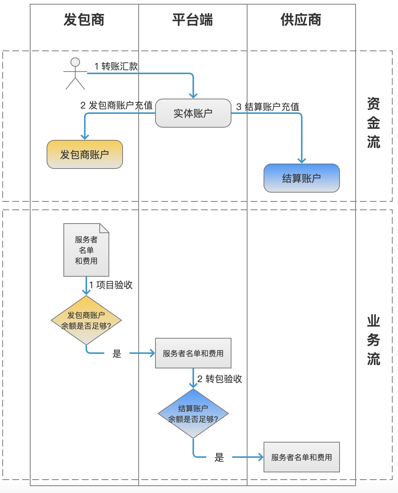

# 系统流程说明

系统核心有三个角色(发包商、平台端、供应商)和两个流程(资金流和业务流)。
整体流程图如下：

## 1 资金流

系统总共有三个账户：

- **发包商账户**：发包商用户的账户，虚拟记账账户；登录平台端后，点击导航菜单“发包商管理-发包商账户管理”可以查看。
- **实体账户：**平台端的实体银行账户，对应真实的银行卡账户；平台端系统，点击导航栏“资金管理-实体账户”可以查看。
- **结算账户：**供应商的账户，相当于供应商记录平台端余额的记账账户；平台端系统，点击导航栏“资金管理-结算账户”可以查看。

资金操作流程：
1、发包商通过银行转账方式向平台端指定的银行卡账户(实体账户)汇款。
2、平台端收到汇款后，向发包商账户充值；完成该步骤后，发包商才能完成“项目验收”操作。
3、平台端将实体账户的金额(由发包商所汇)充值进结算账户；完成该步骤后，平台端才能完成“转包验收”操作。

## 2 业务流

1、发包商用户在发包商端系统向平台端提交项目验收；此时系统会判断发包商账户余额是否足够，如果账户余额不足会提示，且无法继续。

2、平台端收到发包商提交的验收申请后，在平台端系统向供应商进行转包验收操作，此时系统会判断结算账户的余额是否足够，如果不足会提示且无法继续。
